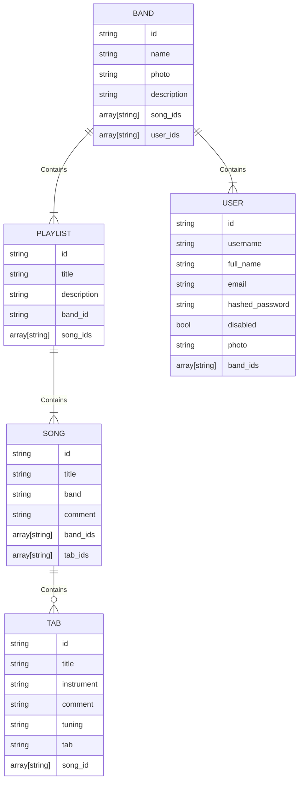

# Bandanize
Stop using the Whatsapp group description to organize your repertory.

## Table of Contents

1. [API](#API)
2. [DB](#DB)
3. [UI](#UI)

## 1. API
Built with Python 3.10 and FastAPI and Docker.

### Endpoints
---
#### Auth
Work in progress...

#### Bands
Work in progress...

#### Playlists
Work in progress...

#### Songs
Work in progress...

#### Tabs
Work in progress...

## 2. DB
MongoDB.

### Models
---
#### Entity Relations

## 3. UI
Built with React Native and Docker.

### Screens
---
Work in progress...

### Components
---
Work in progress...

